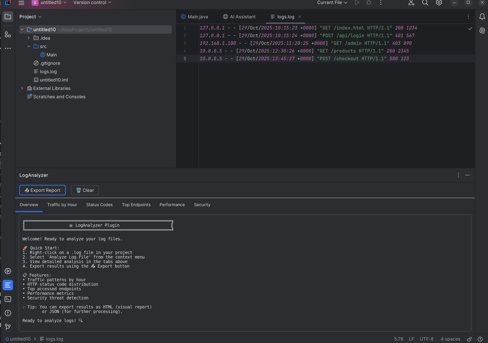
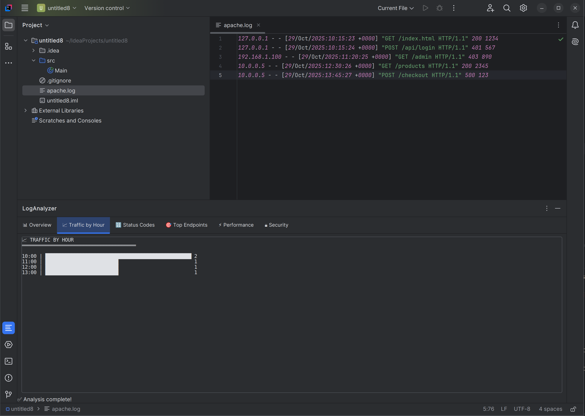

# LogAnalyzer - IntelliJ IDEA Plugin

<!-- Plugin description -->
An IntelliJ IDEA plugin for analyzing Apache/Nginx log files with detailed insights and visualizations.

Analyze Apache/Nginx log files directly in your IDE with powerful insights:
- **Traffic Analysis** - View request patterns by hour with visual charts
- **Status Codes** - Distribution of HTTP response codes with percentages
- **Top Endpoints** - Most frequently accessed URLs
- **Performance Metrics** - Response size analysis and data transfer statistics
- **Security Analysis** - Detect suspicious activity and potential attacks

Perfect for developers and DevOps engineers who need to analyze web server logs during development and debugging.
<!-- Plugin description end -->

## 🚀 Features

- Visualize traffic by hour
- HTTP status code breakdown (2xx, 3xx, 4xx, 5xx)
- Top endpoints and request counts
- Performance metrics (response size, data transferred)
- Security analysis (suspicious IPs, failed logins)
- Export results to HTML/JSON

## 📸 Screenshots

## 🔧 Installation

1. Clone this repository
2. Run `./gradlew buildPlugin`
3. In IntelliJ IDEA: `Settings → Plugins → ⚙️ → Install Plugin from Disk`

## 📖 Usage

1. Right-click on any `.log` file in your project
2. Select **"Analyze Log File"**
3. View detailed analysis in the LogAnalyzer tool window
4. Click **Export Report** to save results as HTML or JSON

## 🛠️ Built With

- IntelliJ Platform SDK
- Java 21
- Gradle

## 📝 Supported Log Formats

- Apache Combined Log Format
- Nginx Access Logs

## 🚧 Roadmap

- Live log tailing
- Log filtering and search
- Custom threshold configuration

## 📄 License

MIT License - see LICENSE file for details

## 👨‍💻 Author

Matei Gatin - [GitHub](https://github.com/Matei-Gatin)
