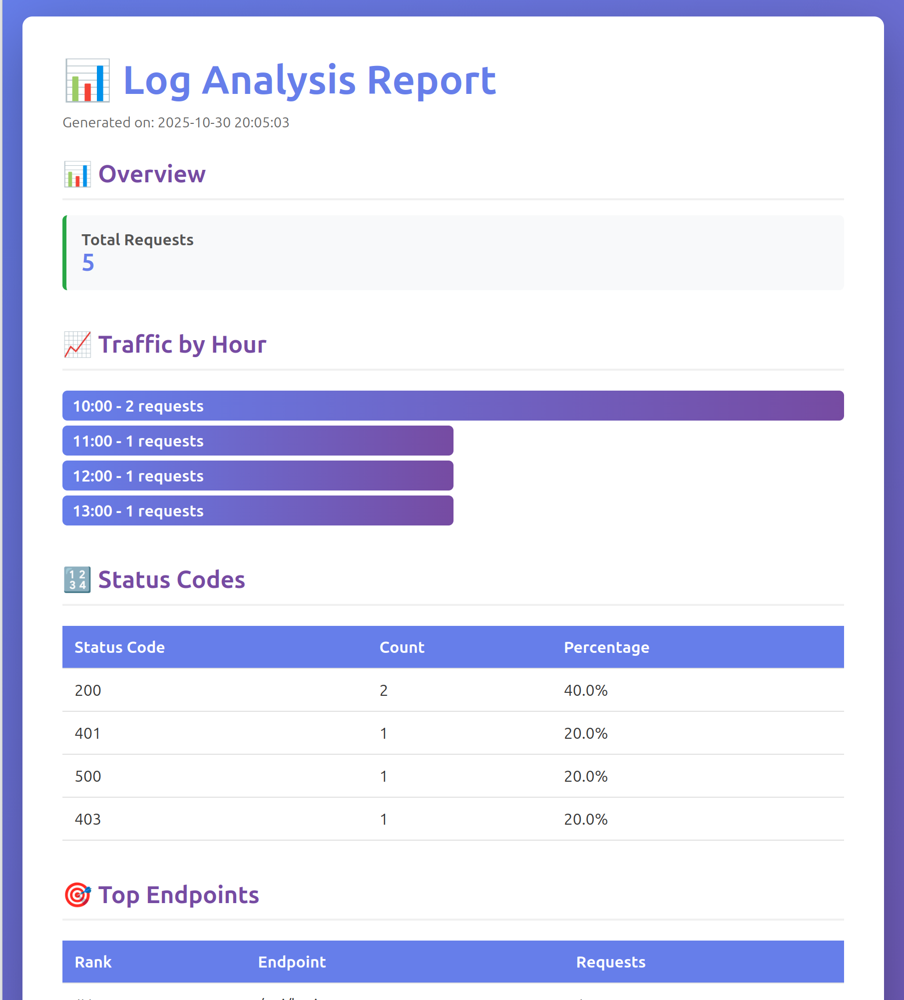

# LogAnalyzer - IntelliJ IDEA Plugin

<!-- Plugin description -->
An IntelliJ IDEA plugin for analyzing Apache/Nginx log files with detailed insights and visualizations.

Analyze Apache/Nginx log files directly in your IDE with powerful insights:
- **Traffic Analysis** - View request patterns by hour with visual charts
- **Status Codes** - Distribution of HTTP response codes with percentages
- **Top Endpoints** - Most frequently accessed URLs
- **Performance Metrics** - Response size analysis and data transfer statistics
- **Security Analysis** - Detect suspicious activity and potential attacks

Perfect for developers and DevOps engineers who need to analyze web server logs during development and debugging.
<!-- Plugin description end -->

## ✨ Features

### 📊 Real-Time Analysis
- **Live Watch Mode** - Automatically re-analyze logs when files change
- **Instant Processing** - Parse thousands of log entries in seconds
- **Visual Charts** - ASCII-based charts for traffic patterns and distributions

### 🔍 Advanced Filtering
- **Keyword Search** - Filter by IP address, endpoint, or any text
- **Date Range** - Analyze specific time periods
- **Status Code Filter** - Focus on specific HTTP response codes
- **Combined Filters** - Stack multiple filters for precise analysis

### 📈 Comprehensive Analysis
- **Traffic by Hour** - Request distribution with visual timeline
- **Status Code Breakdown** - Success rates, errors, and redirects
- **Top Endpoints** - Most accessed URLs with request counts
- **Performance Metrics** - Response sizes and data transfer statistics
- **Security Analysis** - Detect brute force attempts and suspicious IPs

### 📤 Export Capabilities
- **HTML Reports** - Beautiful, self-contained reports with charts
- **JSON Data** - Machine-readable format for further processing
- **One-Click Export** - Quick access via toolbar or keyboard shortcut

### ⌨️ Keyboard Shortcuts
- `Ctrl+F` - Focus search field
- `Ctrl+Shift+G` - Export report
- `Ctrl+W` - Toggle watch mode
- `Escape` - Clear filters
- `Enter` - Apply filters

## 📸 Screenshots

### Main Interface


### Analysis Results


### HTML Export


## 🔧 Installation

### From Release
1. Download the latest `.zip` from [Releases](https://github.com/Matei-Gatin/LogAnalyzer-Plugin/releases)
2. In IntelliJ IDEA: `Settings → Plugins → ⚙️ → Install Plugin from Disk`
3. Select the downloaded file and restart IDE

### From Source
1. Clone this repository:
   ```bash
   git clone https://github.com/Matei-Gatin/LogAnalyzer-Plugin.git
   cd LogAnalyzer-Plugin
   ```
2. Build the plugin:
   ```bash
   ./gradlew buildPlugin
   ```
3. Install from disk: `build/distributions/LogAnalyzer-Plugin-*.zip`

## 📖 Usage

### Basic Analysis
1. Right-click any `.log` file in your project
2. Select **"Analyze Log File"**
3. View results in the LogAnalyzer tool window

### Watch Mode (Real-Time Monitoring)
1. After analyzing a file, click **"▶ Start Watch Mode"**
2. Any changes to the log file will trigger automatic re-analysis
3. Click **"⏸ Pause Watch"** to stop monitoring

### Filtering Logs
1. Use the filter panel at the top of the tool window
2. Enter search keywords, date ranges, or status codes
3. Click **"Apply Filter"** or press `Enter`
4. Results update immediately to show only matching entries

### Exporting Reports
1. Click the **"📤 Export Report"** button in the toolbar
2. Choose format: HTML (visual) or JSON (data)
3. Select save location
4. Optionally open the report immediately

## 🛠️ Built With

- **IntelliJ Platform SDK** - Plugin framework
- **Java 21** - Core language
- **Gradle** - Build system
- **Gson** - JSON processing

## 📝 Supported Log Formats

Currently supports:
- **Apache Combined Log Format**
- **Nginx Access Logs**

Example log format:
```
127.0.0.1 - - [30/Oct/2024:10:15:30 +0000] "GET /api/users HTTP/1.1" 200 1234
```

## 🎯 Use Cases

- **Development** - Analyze local development server logs
- **Debugging** - Track down errors in production logs
- **Performance** - Identify slow endpoints and large responses
- **Security** - Detect brute force attacks and suspicious activity
- **Monitoring** - Watch logs in real-time during testing

## 🚀 Roadmap

Future features planned:
- Custom log format support
- More export formats (PDF, CSV)
- Advanced visualizations
- Log comparison tool
- Custom alert rules

## 🤝 Contributing

Contributions are welcome! Please feel free to submit a Pull Request.

## 📄 License

MIT License - see LICENSE file for details

## 👨‍💻 Author

**Matei Gatin**
- GitHub: [@Matei-Gatin](https://github.com/Matei-Gatin)

---

Made with ❤️ for the IntelliJ Platform
